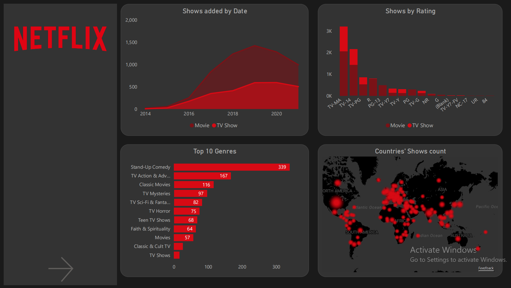
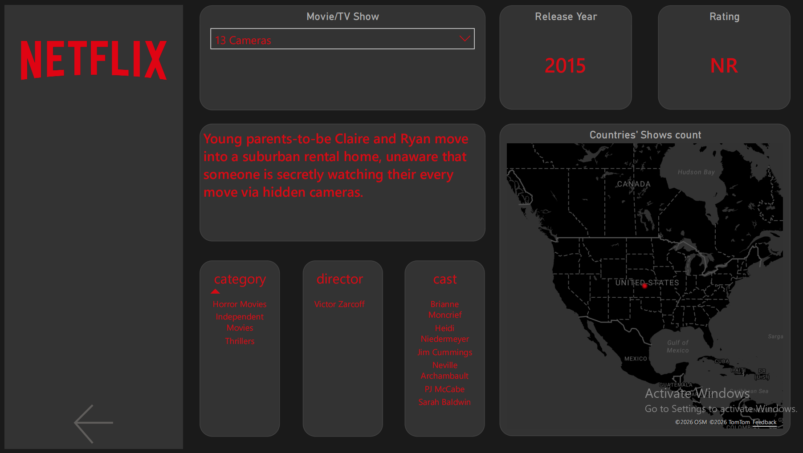
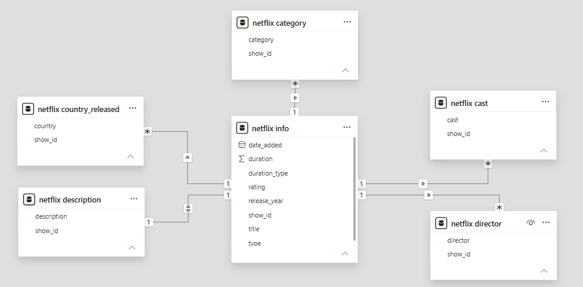

# Netflix Content Analysis Dashboard
### Tools: Excel · Power Query · Power BI

A 2-page interactive dashboard analyzing Netflix titles across genres, countries, ratings, and content type — built on a normalized star-schema data model with 6 related tables.

---

## Dashboard Preview

| Page | Description |
|---|---|
|  | Overview page — trends, genres, map, ratings |
|  | Detail page — cards, pivot tables, country map |

---
## SQL — Data Normalization Queries

Before loading into Power BI, the raw wide-format CSV tables were 
normalized in MySQL using UNION-based queries to unpivot multi-value 
columns into clean long-format tables.

| File | What it does |
|---|---|
| `sql/create_listed_in_table.sql` | Unpivots 3 genre columns → one row per genre |
| `sql/create_directors_table.sql` | Unpivots 13 director columns → one row per director |
| `sql/create_countries_table.sql` | Unpivots 12 country columns → one row per country |
| `sql/create_cast_table.sql` | Unpivots 50 cast columns → one row per cast member |

> See the `sql/` folder for all query files.

## Data Model

*Normalized star-schema: netflix info (fact) linked to category,
country_released, cast, director via show_id*

The raw Netflix dataset was normalized into **6 related tables** using Power Query:

| Table | File | Key columns | Used in visuals |
|---|---|---|---|
| `netflix info` | info.csv | show_id, type, title, date_added, release_year, rating, duration | All pages |
| `netflix category` | listed_in.csv | show_id, listed_in_1/2/3 | Top 10 Genres chart |
| `netflix country_released` | country.csv | show_id, country_1 ... country_12 | Azure Map |
| `netflix cast` | cast.csv | show_id, cast_1 ... cast_50 | Cast pivot table |
| `netflix director` | director.csv | show_id, director_1 ... director_13 | Director pivot table |
| `netflix description` | description.csv | show_id, description | Page 2 — description card (displays show/movie synopsis on selection) |

> All tables linked back to `netflix info` via show_id
---

## Dashboard Pages

### Page 1 — Overview
| Visual | Type | Fields |
|---|---|---|
| Shows added by Date | Area chart | date_added (year hierarchy), COUNT(show_id), type |
| Top 10 Genres | Bar chart | category, COUNT(show_id) |
| Countries' Shows count | Azure Map | country, COUNT(show_id) |
| Shows by Rating | Column chart | rating, COUNT(show_id), type (Movie/TV Show) |

### Page 2 — Detail / Explorer

| Visual | Type | Fields |
|---|---|---|
| Countries' Shows count | Azure Map | country, COUNT(show_id) |
| Rating | Card | rating |
| Release Year | Card | release_year |
| Description | Card | description (updates dynamically based on selected title) |
| Movie/TV Show | Slicer | title (filtered by type) |
| Genre table | Pivot table | listed_in |
| Director table | Pivot table | director |
| Cast table | Pivot table | cast |

---

## Key Data Preparation Steps (Power Query)

1. **Loaded raw Netflix CSV** — 6,000+ rows with multi-value columns (genres, countries, cast as comma-separated strings)
2. **Split multi-value columns** — used `Text.Split` and `Table.ExpandListColumn` to unpivot genres, countries, and cast into separate rows
3. **Created normalized tables** — each entity (cast, director, category, country) became its own query/table
4. **Handled missing values** — replaced nulls in `director`, `cast`, `country`, and `date_added`
5. **Standardized date formats** — parsed `date_added` into proper Date type and extracted year hierarchy
6. **Built relationships** — linked all tables back to `netflix info` via show_id

---

## Key Insights

- Content volume grew significantly year-over-year, with peak additions in the 2018–2020 period
- **Movies outnumber TV Shows** across the catalogue
- **International Drama, Comedies, and Documentaries** are the top genres
- The **US, India, and UK** dominate content origin
- TV-MA and TV-14 are the most common ratings, covering the majority of titles

---

**[▶ View live dashboard on Power BI](https://app.powerbi.com/view?r=eyJrIjoiZWI5MDhmNzQtYzM0OS00NmNiLWEzY2MtMjFhNzdkYmVhZWQ4IiwidCI6ImVhZjYyNGM4LWEwYzQtNDE5NS04N2QyLTQ0M2U1ZDc1MTZjZCIsImMiOjh9)**
